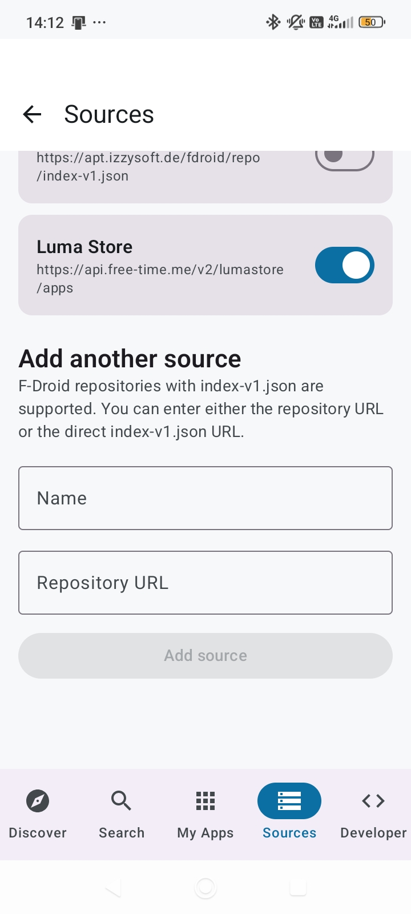

<h1>🛍️ Luma Store</h1>

<i>A modern app store client for Android, focusing on F-Droid and community sources</i>

<h1>📸 Screenshots</h1>

# Repository, Build and App Informations

)

Luma Store is a modern Android application that allows you to discover, install, and update apps from various sources. With a focus on F-Droid and community-driven repositories, it offers a clean and intuitive interface following Material 3 guidelines.

## ✨ Key Features

- 🌍 **Multiple Sources**: Support for F-Droid repositories (index-v1.json) and custom community sources.
- 🔍 **Powerful Search**: Quickly find apps across all enabled repositories.
- 📦 **App Management**: Manage your installed apps, view details, and keep them up to date.
- 🛡️ **Source Filtering**: Filter apps by license (Open Source / Closed Source) and specific repositories.
- 🎨 **Material 3 & Dynamic Colors**: A modern UI that adapts to your system theme and wallpaper (Android 12+).
- ⚙️ **Custom Repositories**: Add your own F-Droid repo URLs easily.
- 🔔 **Background Updates**: Automatic background sync for updates and developer notifications.
- 👨‍💻 **Developer Area**: Integration with Supabase (GitHub/GitLab) for developers to manage their submissions.

## 🛠️ Technology Stack

- **Jetpack Compose**: Modern UI framework for declarative and reactive interfaces.
- **Kotlin**: The primary language for robust and concise Android development.
- **Ktor**: Asynchronous HTTP client for fetching repository indices and APKs.
- **Supabase**: Backend integration for authentication and app metadata.
- **Coil 3**: Efficient image loading with support for modern Compose features.
- **WorkManager**: Reliable background processing for periodic sync tasks.

## 📥 Download & Installation

### Get the Latest Version

You can download the latest version of GeoWeather from the following platforms:

- **GitHub Releases**: [Direct Download](https://github.com/FreetimeMaker/Luma-Store-Android/releases/latest)
- **F-Droid**: [com.freetime.geoweather](https://f-droid.org/packages/com.freetime.lumastore)
- **OpenApk**: [OpenAPK](https://www.openapk.net/de/lumastore/com.freetime.lumastore/)
- **GitHub Store**: [Open in GitHub Store](https://github-store.org/app?repo=FreetimeMaker/Luma-Store-Android)

## 📄 License

This project is licensed under the [GPL-3.0 License](LICENSE).

## ❤️ Support This Project

Luma Store is 100% free and open source.

- ⭐ **[Star](https://github.com/FreetimeMaker/Luma-Store-Android/star)** this repository
- 🐛 **[Report](https://github.com/FreetimeMaker/Luma-Store-Android/issues)** bugs and issues
- 💡 **[Suggest](https://github.com/FreetimeMaker/Luma-Store-Android/issues)** new features
- 📧 **[Contact](mailto:FreetimeMaker@proton.me)** via Email

---

## 🤝 Contributing

Contributions are welcome! Feel free to open issues or submit pull requests.

### Contributors :handshake:

## 🌟 Star History

<a href="https://www.star-history.com/?repos=freetimemaker%2Fluma-store-android&type=date&legend=top-left">
 <picture>
   <source media="(prefers-color-scheme: dark)" srcset="https://api.star-history.com/chart?repos=freetimemaker/luma-store-android&type=date&theme=dark&legend=top-left" />
   <source media="(prefers-color-scheme: light)" srcset="https://api.star-history.com/chart?repos=freetimemaker/luma-store-android&type=date&legend=top-left" />
   
 </picture>
</a>

---

## 🤝 Donations

If you like GeoWeather, I'd appreciate a small donation — thank you! Below are some common cryptocurrency options.

Alternatively, you can also display the addresses directly:

- Bitcoin (BTC): `1DsCAVrzvGokrzXpe6YR33QuTo5EppiKRE` — or open in block explorer by clicking the badge above
- Litecoin (LTC): `LU2ERRXKTeKnzpuieQcpsBteViEY7ff5Wg` — or open in block explorer by clicking the badge above

<i>Developed with ❤️ by FreetimeMaker</i>

